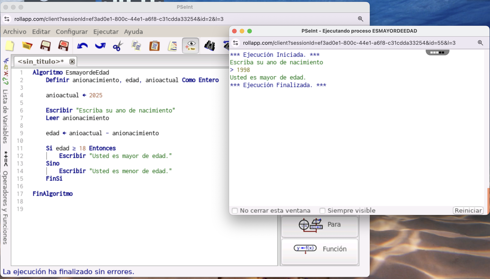

# 🎂 Algoritmo ¿Es mayor de edad?

Este programa en **PSeInt** permite al usuario ingresar su año de nacimiento y calcula si es **mayor** o **menor de edad**, utilizando una operación de resta y una estructura condicional simple.

---

## 📋 ¿Cómo funciona?

El algoritmo realiza los siguientes pasos:

1. Solicita al usuario que escriba su año de nacimiento.
2. Calcula la edad restando el año actual (2025) al año de nacimiento.
3. Verifica si la edad es mayor o igual a 18.
4. Muestra en pantalla si la persona es mayor o menor de edad.

---

## 📷 Vista previa

 

---

## 🚀 ¿Cómo ejecutarlo?

### ▶️ Pasos:

1. Abre **PSeInt**.
2. Crea un nuevo archivo y copia el siguiente código:

```pseudocode
Algoritmo EsmayordeEdad
    Definir anionacimiento, edad, anioactual Como Entero

    anioactual <- 2025

    Escribir "Escriba su ano de nacimiento"
    Leer anionacimiento

    edad <- anioactual - anionacimiento

    Si edad >= 18 Entonces
        Escribir "Usted es mayor de edad."
    Sino
        Escribir "Usted es menor de edad."
    FinSi

FinAlgoritmo
